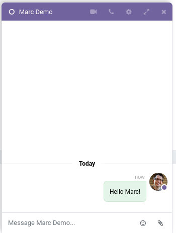
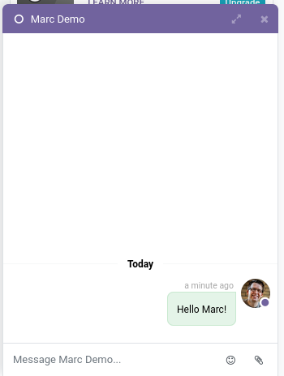

Remove call buttons from the Chatter view

## Chatter Sidebar 

### By default

### With module installed

## Chatter thread topbar

### By default

### With module installed

## Minimized chat window

### By default

### With module installed

