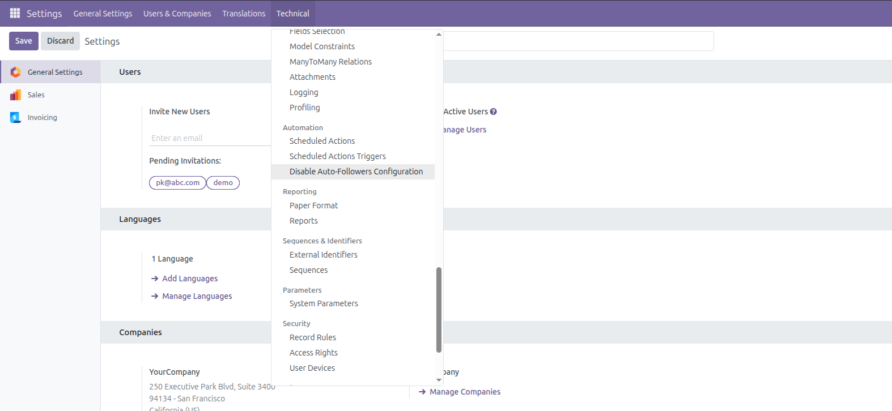
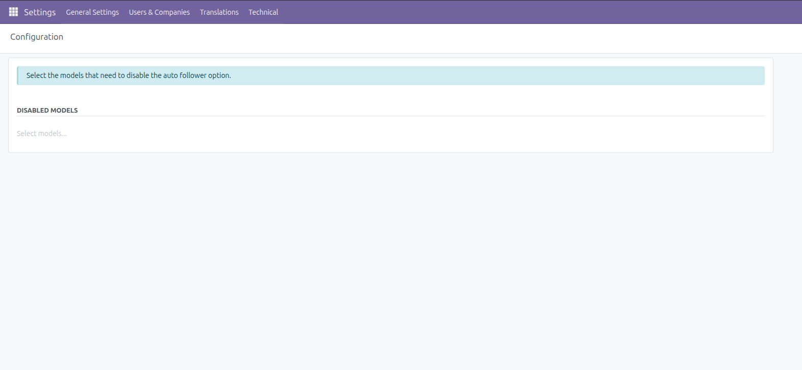
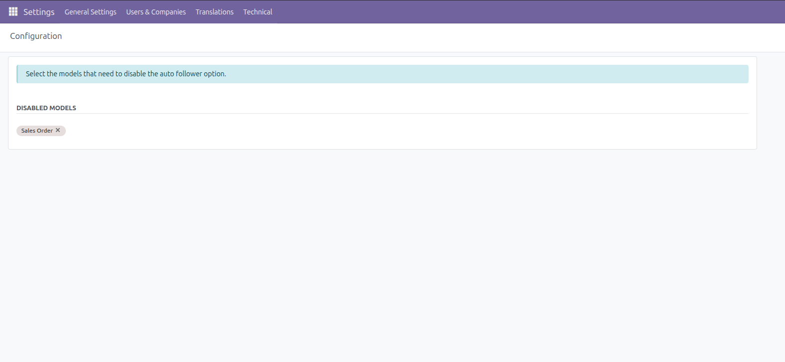
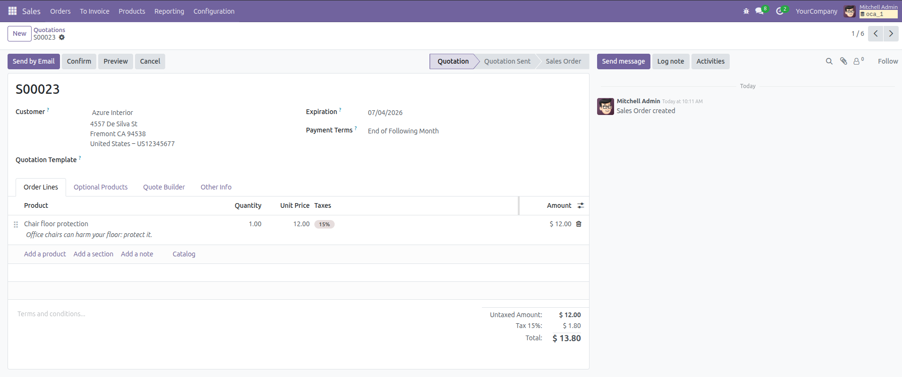

## Configuration Workflow

### Step 1 — Access the Configuration Menu

Activate **Developer Mode (debug)** in your Odoo database, then navigate to:

**Settings > Technical > Automation > Disable Auto-Follower Configuration**

### Step 2 — Unified Singleton Form View

The menu action opens a single, clean Form view that represents the global
configuration. Record creation and deletion are intentionally restricted to
maintain system integrity — there is always exactly one configuration record.

### Step 3 — Select Models

Use the **Many2many tags** dropdown field to select the target models on which
auto-follower subscriptions should be disabled (e.g. `sale.order`,
`purchase.order`, `res.partner`). Save your changes.

### Step 4 — Verification

Create a new record on one of the selected models (for example, create a Sales
Order). You will notice that the record creator is **not** automatically
subscribed as a follower in the document's chatter thread.

